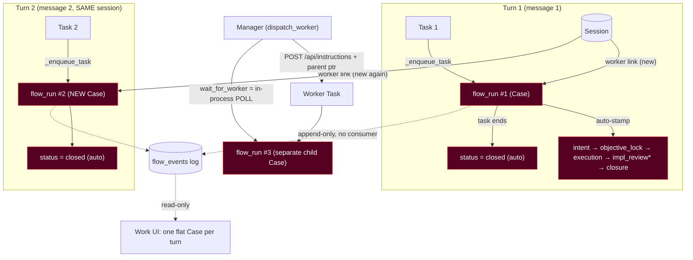
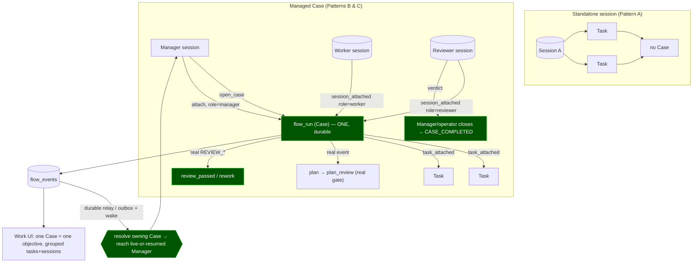

# Workflow Architecture Audit — Case / Task / Session Model

**Date:** 2026-07-11 · **Branch audited:** `feat/session-lifecycle-reconcile` (HEAD `4cd03f8`, M3 Phase 3.0 merged into `main`)
**Answers:** `.ai/workflow_architecture_audit_handoff.md` · **Status:** verified against code, no runtime changes made.

> Terminology note for this repo: the handoff says "Telegram"; the load-bearing control
> surface here is the **Web UI** (`web/`) + control API. Read every "operator surface"
> reference as Web-UI-first. `Case == flow_run` (settled, not debated).
> §2.6 "optional provider features" is intentionally **out of scope** for this audit.

---

## 0. TL;DR

The defect is **real and confirmed at two levels**, but it is a **narrow wiring bug, not a
substrate rebuild**. The durable substrate (`flow_runs` / `flow_links` / `flow_events`) is
well-built, honestly scoped, and *already structurally supports* "one Case spanning many
Tasks and many Sessions." The bug is entirely in the **write policy**:

1. **Case is born per turn.** `_enqueue_task → _record_flow_run_start → db.create_flow_run`
   mints a **fresh `uuid4` flow_run for every task** (`orchestrator.py:1643,1722` →
   `db.py:1463`). There is **no lookup-or-reuse** of an open case. 10 messages to one
   session ⇒ 10 Cases.
2. **The session→case link is shattered the same way.** Each turn also writes a *new*
   `session → flow (role 'worker')` link to that new flow_run (`orchestrator.py:1749`).
   So even the relationship ledger is one-worker-link-per-message. The UI hides this by
   resolving a session to its **most-recent** case only (`db.py:1650-1653`) — a cosmetic
   mask, not a fix.
3. **The lifecycle is half theater.** Per turn the loop auto-stamps
   `execution → impl_review → closure` and then `_flow_terminal_outcome` sets
   `flow_runs.status='closed'` on the single task's success (`orchestrator.py:2435,2501,
   2518,2524`). `impl_review` is stamped though the code itself admits **no reviewer role
   exists** (`orchestrator.py:2015-2018`). **Honesty credit:** `plan` / `plan_review` are
   *never* stamped — the timeline does not invent planning; it only over-represents
   `impl_review`/`closure`. (This corrects the handoff's implication that *all six* stages
   are rubber-stamped — two of them are honestly absent.)

**Critical invariant is violated:** `Task finished == worker finished == Case completed`
today, because closure is a side-effect of the one task ending. The spec's intended
`Task finished != Case completed` does not hold.

**What is NOT broken (don't rebuild it):** the schema, the append-only event log, the
approval→case linkage, the mesh worker-result durability (reconcile spool + startup
reattach into `mesh_tasks`), and the read model / Work UI (which render the substrate
faithfully — they show garbage only because the writer feeds them garbage).

---

## A. Plain-language architectural explanation

### What the system does today
Every inbound instruction — Web UI, `.task.md`, internal, or a Manager's `dispatch_worker`
— funnels through `orchestrator._enqueue_task`, the single admission choke point. There it
unconditionally creates one `flow_run` row (the "Case"), links the executing session to it
as a `worker`, walks the row through `intent → objective_lock → execution → impl_review →
closure`, and closes it when the task's mesh result comes back. All of this is behind
`HARNESS_FLOW_DRIVE`, which is **ON in the live environment**, so live is producing exactly
this per-turn-Case shape right now.

### Why one-Task-per-Case is wrong (verified)
A Case is defined (WORK_CONTROL_SUBSTRATE + M3 spec §1) as *one operator objective* that
can span many turns and many sessions (manager + workers + reviewer) until the objective is
accepted. Minting a Case at task-admission collapses "objective" into "turn": the Case can
never outlive a single execution, can never accumulate a second Task, and closes itself the
instant the worker returns — which is precisely the invariant the spec forbids
(`Task finished != Case completed`). The stage timeline then narrates a review-and-closure
quality loop that never ran.

### Which of the three valid patterns are supported today
| Pattern | Supported? | Why |
|---|---|---|
| **A. Standalone session, many tasks, no Case** | **No** | Every driven task creates a Case; there is no "no-Case" path when `HARNESS_FLOW_DRIVE` is ON. (Only truly Case-less path is flag OFF or `run_oneoff` with no `session_id`.) |
| **B. Dedicated managed session == one Case, many tasks** | **No** | The second turn on the same session mints a *second* Case; the first is already `closed`. |
| **C. Managed Case spanning manager + worker + reviewer sessions** | **Structurally yes, behaviorally no** | `flow_links` *can* hold N sessions/roles per case, but the writer only ever emits a single `worker` link per per-turn case; `manager`/`reviewer` are never written. |

So **zero of the three are behaviorally supported** end-to-end today; the substrate can
represent all three.

### The correct admission / affiliation / continuity / closure model
- **Admission:** a plain turn on a session attaches to that session's **open Case if one
  exists**, otherwise runs **Case-less** (Pattern A). A Case is *created* only by an explicit
  managed entrypoint (Manager `open_case` / an objective-bearing dispatch), not by
  `_enqueue_task`.
- **Affiliation:** a Session carries a durable *current-Case + role* (manager/worker/
  reviewer/standalone) that survives turns; the per-turn link becomes `task → case`
  (which genuinely is per-turn) rather than re-minting `session → case` each time.
- **Continuity:** a Case stays open across turns and sessions until its objective is
  accepted; pause/resume reuse the same `flow_run_id`.
- **Closure:** only an authoritative actor (Manager verdict, or operator) closes a Case;
  a worker/task terminal outcome updates the *task*, not the Case status. `impl_review`/
  `closure` stages are written only when a real review/closure event occurs.

### Downstream effects
- **Manager:** must be able to `open_case`, attach tasks/sessions, and be the sole closer.
- **Events:** need real `TASK_ATTACHED` / `SESSION_ATTACHED` on reuse and a real
  `REVIEW_*` / `CASE_COMPLETED` only when they happen.
- **Relay:** worker→Case result routing must be **durable and case-bound**, not a live
  in-process poller (today `wait_for_worker` dies with the Manager process).
- **Review/approval:** the substrate is display-ready for these but has no producer.
- **UI:** Work inbox should list **objectives (Cases)**, not turns, and group a Case's
  tasks/sessions; standalone turns should not appear as Cases at all.

---

## B. Diagrams

### B.1 Current implementation (verified)

`impl_review*` = stamped with no reviewer. `wait_for_worker` is a live poller in the
Manager's MCP subprocess — it dies if the Manager dies.

### B.2 Target implementation (after fixes)

---

## C. Practice-to-roadmap mapping

Classification legend (from handoff §5): **OK**=correct · **EQV**=equivalent-under-other-name ·
**PART**=partial/needs-hardening · **INC**=incidental/no-contract · **SPEC**=specified-not-built ·
**ORPH**=built-but-off-roadmap · **WRONG-STAGE** · **MISS-FU**=missed, needs additive follow-up ·
**FUTURE** · **OPT** · **REJ**.

| Practice (handoff §2) | What the repo has | Verdict | Owning milestone / job |
|---|---|---|---|
| 2.1 Durable work authority (Cases/Tasks/Sessions/lineage/events/approvals/artifacts) | `flow_runs`+`flow_links`+`flow_events`+`mesh_tasks`+`sessions`+approvals; gateway-owned | **EQV** substrate; **PART** authority (writer collapses Case→turn) | M1/M2 built; **Job 1/2** correct writer |
| 2.2 Canonical event model (real lifecycle facts) | `flow.created/stage_changed/closed`, `session.attached`, `task.dispatched`, `approval.*` | **PART** — real edges exist; `impl_review`/`closure` are auto-stamped decoration; `review.*` honestly absent | **Job 3** harden contracts |
| 2.3 Durable relay / wake-up / reconciliation (case-aware) | **Worker-result** durability exists (mesh reconcile spool + startup reattach → `mesh_tasks`). **Case-aware** relay/outbox/ack/dedup/wake = **none**; `wait_for_worker` is in-process poll | **PART** (worker-result), **MISS-FU** (case relay) | **Job 4** durable relay/reconcile |
| 2.4 Gateway control plane for Manager (16 ops) | `dispatch_worker`, `wait_for_worker` only (2 of ~16), double-gated OFF | **INC/PART** — proof-of-plumbing, no real control surface | **Job 5** Manager control surface + role |
| 2.5 Review / approval / safety state | Approvals wired + case-linked. Review/rework: schema+read-model ready, **no producer**. Cancel/pause/resume/limits: none | Approvals **OK**; review **SPEC**; guardrails **FUTURE** | **Job 6** (review), **Job 7** (safety) |
| §3 M4 artifact/spec + scored review | `flow_links` supports `artifact`; generators are docs; no case/event wiring | **FUTURE** | **Job 8** artifact+scored review |
| 2.6 Provider adapters/subagents | out of scope per operator | **OPT** | **Job 9** (off critical path) |

**Roadmap state (verified against docs):** M0 done · M1 live (shadow) · M2 done+merged
(`24dff9b`) · **M3.0 code-complete** (dispatch/wait, on `main`, gated OFF) · **M3.1** (Manager
role: "one intent → one dispatch → one review → close, all durable") **NOT built** ·
**M3.2** (`review.*` emitter) **NOT built** · **M3.3** (kill path, caps, crash recovery)
**NOT built** · **M4** (spec authoring) generators-only.

**The gap the roadmap never names:** M3.1 *assumes* a durable per-intent Case already exists,
but **no milestone specifies Case admission / identity / reuse** — the layer that makes one
Case span many turns of one session. The current per-turn writer is treated everywhere as
correct telemetry. **This is the missing foundation and must land before M3.1.**

---

## D. Corrections to canonical documents (proposed — apply on approval)

These are **additive corrections**, not history rewrites. I have not applied them yet.

1. **`.ai/CONTEXT.md`** — add a "Known defect" note under Current Focus: *"`HARNESS_FLOW_DRIVE`
   ON currently mints one `flow_run` (Case) + one `session→worker` link per turn, and
   auto-stamps `impl_review`/`closure` with no reviewer. Case admission/identity fix is
   the pre-req for M3.1 — see `.ai/workflow_architecture_audit.md` Jobs 1–2."*
2. **`docs/Task_Harness_v0.6_AUTOMATION.md`** — insert a **Case Admission** dependency
   *before* M3.1 in the milestone order; note that M1's per-turn `create_flow_run` was
   correct as a *record* but is wrong as *Case identity*.
3. **`docs/M3_MANAGER_INVOCATION_SPEC.md`** — §1/§5: state explicitly that a reused session
   must stay in ONE Case (not multiply worker-links); mark Phase 3.1 **blocked on** Case
   admission (Jobs 1–2).
4. **`docs/WORK_CONTROL_SUBSTRATE_MILESTONE.md`** — add a follow-up note: the substrate is
   correct; the A26 write-path over-creates Cases; A30's "most-recent link" resolver is a
   cosmetic mask to be retired once Jobs 1–2 land. **Do not mark M2 failed** — its schema
   scope was delivered correctly.

---

## E. Ready-to-dispatch implementation jobs (dependency order)

> Each job is self-contained per handoff §6. All writer changes stay behind
> `HARNESS_FLOW_DRIVE` (live) and must preserve OFF ⇒ byte-identical.
> **Ordering:** 1 → 2 → 3 → 4 → 5 → {6,7} → 8 → 9. Jobs 1–2 are the foundation; nothing
> after M3.1 is honest until they land.

### Job 1 — Correct Case admission & Task/Session affiliation
- **Objective:** Stop minting a Case per turn. A turn attaches to the session's *open* Case
  if one exists; otherwise runs **Case-less** (Pattern A). Cases are created only by an
  explicit managed entrypoint.
- **Verified baseline:** `_enqueue_task` (`orchestrator.py:1643`) → `_record_flow_run_start`
  (`:1693`) → `db.create_flow_run` (`db.py:1463`) always mints a new `flow_run` + a new
  `session→worker` link (`:1749`). No open-Case lookup exists.
- **Scope:** (a) add `db.find_open_case_for_session(session_id)` (join `flow_links`
  entity_type='session' → `flow_runs` where `status` is NULL/open, newest); (b) in
  `_record_flow_run_start`, if an open Case exists → **attach** (`task_attached` link +
  event) instead of `create_flow_run`; (c) if no open Case and no managed intent → **create
  nothing** (Case-less turn); (d) add an explicit `open_case(objective, session_id, role)`
  primitive (`db` + orchestrator) used by the managed entrypoint / Manager.
- **Non-goals:** Manager role prompt (Job 5); review/close semantics (Job 2/6); UI (Job 2).
- **Dependencies:** none (foundation).
- **Affected:** `src/orchestrator.py`, `src/control/db.py`.
- **Implementation intent:** durable `session.current_case_id`+`role` (add nullable columns
  to `sessions`, or derive-and-cache) so affiliation survives turns; per-turn link becomes
  `task→case`, not `session→case`.
- **Acceptance:** 10 turns on one standalone session ⇒ **0** Cases; 10 turns on a
  Case-attached session ⇒ **1** Case with 10 `task` links, **1** `session` link; OFF ⇒
  byte-identical.
- **Evidence required:** SQL dump of `flow_runs`/`flow_links` for both scenarios; test
  asserting no new `flow_run` on turn 2 of an open Case.

### Job 2 — Case continuity, stage transitions & closure semantics
- **Objective:** Make `Task finished != Case completed`. Stages/closure reflect real events,
  not auto-stamps. Retire the "most-recent-link" cosmetic mask.
- **Baseline:** loop auto-stamps `execution/impl_review/closure` (`orchestrator.py:2435,
  2501,2518`) and `_flow_terminal_outcome` closes the Case on task success (`:2524`);
  UI resolves latest link (`db.py:1650-1653`).
- **Scope:** (a) remove auto `impl_review`/`closure` stamps; task terminal outcome updates
  **task** state only, not `flow_runs.status`; (b) Case `status` transitions only via an
  authoritative closer (Job 5/6); (c) pause/resume reuse the same `flow_run_id`; (d) update
  read model to group a Case's N tasks/sessions and show *all* affiliations, not latest-only.
- **Non-goals:** who reviews (Job 6); relay (Job 4).
- **Dependencies:** Job 1.
- **Affected:** `orchestrator.py`, `work_read_model.py`, `web/` Work surface.
- **Acceptance:** a completed worker task leaves its Case `open`; timeline shows no
  `impl_review`/`closure` unless a real event emitted them; Work UI lists Cases (objectives),
  standalone turns absent.
- **Evidence:** timeline of a real turn showing honest stages; UI screenshot of one Case
  grouping multiple tasks.

### Job 3 — Harden canonical event contracts & lineage
- **Objective:** A typed, documented event vocabulary emitted only on real actions;
  `CASE_CREATED/TASK_ATTACHED/SESSION_ATTACHED/CASE_COMPLETED/CASE_CANCELLED` etc.
- **Baseline:** ad-hoc `flow.*`/`session.attached`/`task.dispatched`/`approval.*`; append-only,
  **no consumer** (`db.py` list_flow_events → read model only).
- **Scope:** enumerate the contract in `db.py`/spec; add `actor`/`entity` invariants; ensure
  each Job-1/2 write emits the right typed event.
- **Dependencies:** Jobs 1–2. **Affected:** `db.py`, `orchestrator.py`, docs.
- **Acceptance:** every state change has exactly one typed event with correct actor/entity;
  no decorative events.

### Job 4 — Durable, case-aware relay / wake-up / reconciliation
- **Objective:** Worker completion is routed to the **owning Case** and reaches a live *or
  resumed* Manager, exactly once, even if the Manager process died.
- **Baseline:** `wait_for_worker` is an in-process poller in the Manager's MCP subprocess
  (`mcp_manager.py:276-346`) — dies with the process. Mesh reconcile spool is task-level,
  **not** case-aware. No outbox/ack/dedup on `flow_events`.
- **Scope:** delivery/outbox state keyed by Case + requester origin; a wake/resume path that
  re-binds a replacement Manager to the Case; ack + dedup; reconciler for orphaned
  completions. Reuse the existing `watch_job` long-poll + proactive-turn reach-back cited in
  the M3 spec.
- **Dependencies:** Jobs 1–3. **Affected:** `orchestrator.py`, `mcp_manager.py`, `db.py`.
- **Acceptance:** kill the Manager mid-wait; worker finishes; a resumed Manager receives the
  result once (no loss, no dup).

### Job 5 — Manager control surface & Manager role
- **Objective:** Promote the 2-tool spike to the real control plane + a spawnable Manager
  role that owns a Case and is its sole closer.
- **Baseline:** 2 of ~16 ops (`dispatch_worker`, `wait_for_worker`), double-gated OFF; no
  `open_case/get_case/attach/inspect_worker/read_events/send_instruction/request_review/
  request_input/cancel/pause/resume/publish_artifact/close_case`.
- **Scope:** add the missing MCP tools as thin wrappers over control-API/`db`; wire the
  Manager role prompt + `open_case`; objective lock; authoritative closure.
- **Dependencies:** Jobs 1–4. **Affected:** `mcp_manager.py`, `control_api.py`,
  `claude_driver.py`, docs. This is **M3.1**.
- **Acceptance:** one operator intent → Manager opens one Case → dispatches worker(s) into
  the same Case → inspects → closes; all durable, all in one `flow_run`.

### Job 6 — Review & rework (M3.2)
- **Objective:** Real reviewer role emits `review_requested/passed/failed/rework_requested`;
  Case cannot close with unresolved review.
- **Baseline:** schema+read-model recognize review statuses; **no producer**
  (`orchestrator.py:2015-2018` declines to fabricate). **Dependencies:** Jobs 2,5.

### Job 7 — Approval, cancellation & safety controls (M3.3)
- **Objective:** `flow.interrupted`/kill path, round/turn/cost caps, crash recovery,
  stuck-work handling; Case blocks (not closes) on unmet approval/input/child work.
- **Baseline:** approvals case-linked already; cancel path exits before the completion seam
  (parked). **Dependencies:** Jobs 2,4,5.

### Job 8 — Artifact publication & scored review (M4)
- **Objective:** `publish_artifact` → `artifact` links + events; spec authoring stage +
  rubric-scored acceptance feeding Case closure. **Dependencies:** Jobs 5,6.

### Job 9 — Optional provider adapter/subagent work
- **Off critical path** per operator. Mirror provider-native subagents as first-class
  workers **only if** pursued. **Dependencies:** Jobs 1–5.

---

## F. Adversarial conclusion check

| Challenge | Strongest counter-evidence | Resolution |
|---|---|---|
| Could existing code already support the model under other names? | `flow_links` unique key is `(flow_run_id, entity_type, entity_id, role)` (`db.py:2551`) — N tasks/sessions per Case is **already possible**; read model recognizes manager/worker/reviewer + closed/blocked/review vocab | **Substrate yes, writer no.** The capability exists; nothing *writes* a multi-task/multi-role Case. Fix is wiring (Jobs 1–2), not schema. Conclusion holds. |
| Is one-Task-per-Case intentional for one path only? | It's on the shared choke point `_enqueue_task`, so it hits *every* lane uniformly; the A19/A22 comments call it a "RECORD… nothing reads current_stage" | Intentional as a **record**, wrong as **Case identity**. The record framing is exactly why it was never noticed to collapse objectives. Conclusion holds. |
| Could event delivery already exist outside `flow_events`? | Mesh reconcile spool + startup reattach durably recover **worker task results** into `mesh_tasks` | Real — but **task-level, not case/Manager-level**. No case-bound relay/wake exists. Job 4 is not duplicative; the handoff's "no relay at all" framing is **too strong** and I corrected it. |
| Could review/approval already exist as generic state? | Approvals table + `approval` flow-links + `approval.*` events are wired and case-aware | **Approvals: yes** (don't rebuild). **Review: no producer.** Split accordingly (approvals OK, review = Job 6). |
| Could a proposed job duplicate planned work? | M1/M2/M3.0 already shipped substrate + dispatch/wait; M3.1/3.2/3.3 already scoped in the M3 spec | Jobs 5–8 **map onto** M3.1–M4 (not new). Jobs **1–2 are genuinely new** — no milestone specifies Case admission/identity. Correctly additive. |
| Could a "missing" feature be intentionally out of scope? | §2.6 provider adapters; token-economics O3; approvals-automation (DEFERRED #25) | Yes — Job 9 stays off critical path; approvals-automation stays deferred; O3 stays measurement-only. Respected. |

**Load-bearing conclusion survives:** the Case-per-turn collapse is real, is a writer-policy
bug over a sound substrate, is masked (not fixed) by the most-recent-link resolver, and is
**not on any milestone plan** — Jobs 1–2 are the missing foundation for M3.1.

---

## Final decision standard — answers

- **When is a Case created?** (target) only by an explicit managed entrypoint / Manager
  `open_case`. (today) on every task.
- **When is no Case created?** (target) ordinary standalone turns. (today) never, when
  `HARNESS_FLOW_DRIVE` ON.
- **How does a Task join a Case?** (target) `find_open_case_for_session` → `task_attached`
  link+event. (today) impossible — always a new Case.
- **How does a Session participate/leave?** (target) durable `current_case_id`+role. (today)
  re-derived per turn, latest-link-wins.
- **How does one Case span many Tasks/Sessions?** substrate already allows it; Jobs 1–2 wire
  the writer.
- **How are worker results returned to the correct Case?** (target) Job 4 durable relay.
  (today) in-process poll that dies with the Manager.
- **How is a Manager resumed after async completion?** (target) Job 4 wake/resume. (today)
  manual re-call only.
- **What events are real?** `flow.created`, `session.attached`, `task.dispatched`,
  `approval.*`, `flow.closed`-on-success. **Fabricated/decorative:** `impl_review`,
  `closure` stamps. **Honestly absent:** `plan`, `plan_review`, `review.*`.
- **What closes a Case?** (target) authoritative Manager/operator verdict. (today) the one
  task ending.
- **Which milestones remain valid?** M0/M1/M2/M3.0 — all valid; M2 substrate is the asset.
- **Which stages need additive hardening?** the A26 write-path (Jobs 1–2), events (Job 3).
- **What belongs in each future stage?** Jobs 5→M3.1, 6→M3.2, 7→M3.3, 8→M4.
- **What runs next?** **Job 1 (Case admission).**
