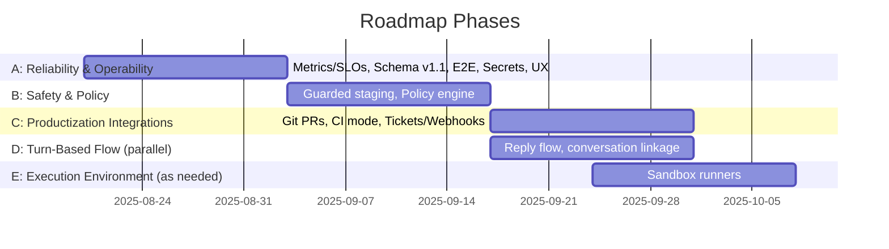

# AI Task Orchestrator — Roadmap to Production

## Purpose
Turn natural‑language requests into reproducible, headless code delivery: parse tasks, execute with Claude Code, validate/summarize, and emit artifacts/telemetry.

## Scope and Non‑Goals
- Scope: Windows‑first operability, headless execution, artifact‑centric traceability, optional Telegram interface.
- Non‑Goals (near term): API-based editing, complex multi‑agent orchestration, heavy UI.

## Current State
- File‑based workflow; robust watcher with debouncing and archival
- LLAMA/Ollama mediation with fallback; prompt/summary caps
- Claude Code bridge: headless mode, retries/backoff, error taxonomy
- Artifacts v1 + validation MVP; events in `logs/events.ndjson`
- Ops tools: `doctor`, `stats`, `tail-events`, Telegram `/progress`

## North Star
Hands‑off code delivery: NL intent → safe branch/PR with diffs, tests, reviews, retries → auto‑merge under policy.

## Phased Roadmap

### Phase A: Reliability and Operability (now → 2 weeks)
- Metrics & SLOs: enrich `stats`, emit periodic `logs/metrics.json`, CI health gate
- Schema v1.1: add `security` (guarded_write, allowlist_root, violations[]) and linkage clarifications; update validator
- E2E stability: watcher tests; restart/persistence checks (Windows edge cases)
- Secrets/privacy: expand redaction; `.env.example`; optional pre‑commit secret scan
- Operational UX: `tail-events` follow + color, `doctor` write probes, `/progress --since`

### Phase B: Safety and Policy (2 → 4 weeks)
- Guarded‑write staging (optional): store diffs; `apply-guarded` CLI; Telegram approval hint
- Policy engine: repo/path allowlists, task‑type “write lanes,” approval rules

### Phase C: Productization Integrations (4 → 6 weeks)
- Git PR workflow: create branches/PRs, attach artifacts as PR comments, re‑run on feedback, auto‑merge on green
- CI mode: validate artifacts/schema/security on PR; block on violations
- Tickets/webhooks: Jira/Linear linking; outbound webhooks besides Telegram

### Phase D: Agentic Turn‑Based Flow (parallel, gated by A/B)
- `/reply <task_id>` to continue tasks with constraints; persist `conversation[]` + linkage; LLAMA summarizes prior turns

### Phase E: Execution Environment (as needed)
- Sandboxed runners (container/VM) to enable full toolset safely without local risk

## Deliverables (selected)
- Metrics: p50/p95 per phase, error‑class counts; CI health gate passes
- Schema v1.1: validator enforces new fields; legacy skippable
- Guarded staging: diffs persisted and apply cleanly with telemetry
- PR workflow: PR created with artifacts; re‑run + auto‑merge in a sample repo

## Risks and Mitigations
- CLI changes → pin versions; tolerant parsing; suggested actions
- Secret leakage → redaction filters; docs; optional secret scanner
- Overload → queue caps, rate limits, backpressure events

## Success Criteria
- Stable Windows‑first operation; green tests and schema validation
- Operators see status, tails, and metrics without noise
- Clear path from NL intent to PR with traceable artifacts and guardrails

---

## Visual Summary

```mermaid
flowchart LR
    A[User NL Request] --> B[LLAMA Mediation]
    B --> C[Claude Code Execution]
    C --> D[Artifacts v1 + Validation]
    D --> E[Telemetry: events, metrics]
    E --> F[Ops Tools: doctor, stats, tail]
    D --> G[PR Workflow (Phase C)]
    B --> H[/reply Turns (Phase D)]
    C -.optional.-> I[Sandboxed Runner (Phase E)]
```



> For detailed background, see `docs/next_stage.md` and historical blueprint in `docs/plan_distributed_system.md`.

