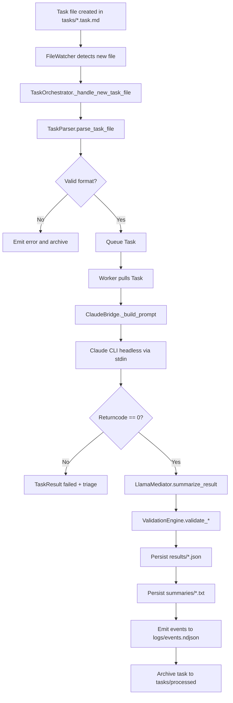

## AI Task Orchestrator — System Architecture

### Overview
The system processes `.task.md` files through an async pipeline that parses, executes, summarizes, validates, and persists artifacts. Components are modular and Windows-friendly.

### Component Map
- Orchestrator (`src/orchestrator.py`): lifecycle, queue, workers, events, artifact writing
- FileWatcher (`src/core/file_watcher.py`): debounced detection of new task files
- TaskParser (`src/core/task_parser.py`): YAML+Markdown parsing into `Task`
- ClaudeBridge (`src/bridges/claude_bridge.py`): headless Claude CLI execution with stdin prompt
- LlamaMediator (`src/bridges/llama_mediator.py`): LLAMA-assisted parsing/prompting/summarization
- ValidationEngine (`src/validation/engine.py`): similarity/entropy/structure checks
- TelegramInterface (`src/telegram/interface.py`): optional notifications and control (opt-in)

### Flow Diagram

### Artifacts
- Results: `results/<task_id>.json` (schema v1, includes orchestration/bridge/llama status)
- Summaries: `summaries/<task_id>_summary.txt` (human-readable)
- Processed tasks: `tasks/processed/*.completed.task.md` or `*.failed.task.md`
- Events: `logs/events.ndjson` (append-only)

### Configuration
- `config/settings.py` exposes: Claude flags, base CWD/allowlist, timeouts, max-turns, validation thresholds, system paths

### Operational Notes
- Prompts are passed via stdin to Claude CLI to avoid argument parsing variability
- Watcher debounces events to handle atomic writes and editor save bursts
- Validation is conservative to reduce false positives; thresholds configurable

### Future Work (tracked in docs/next_stage.md)
- LLAMA-mediated reply turns
- Real-time progress telemetry (phase events, ETA heuristics)
- Broader error taxonomy and recoveries

