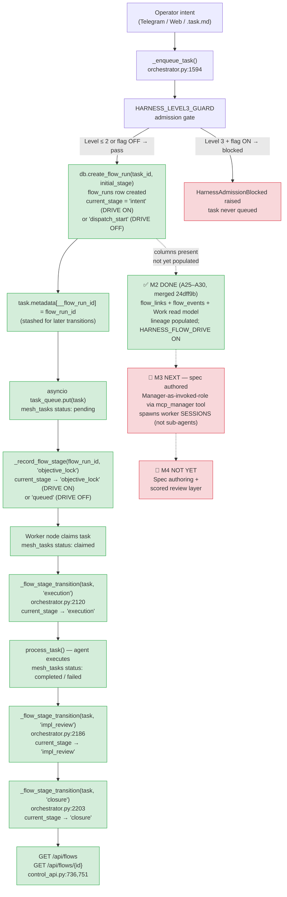

# Flow Map — Automated Harness State Machine (v0.6)

> **Purpose:** One shared picture of where state lands as a flow runs through the
> automated harness. Answer in two minutes: input → where it goes → to whom → then what
> → where state lands.
>
> **Cross-references (link, don't restate):**
> - Kernel spec & §11 field list: [`docs/Task_Harness_v0.4.md`](../Task_Harness_v0.4.md)
> - Automation roadmap & milestones: [`docs/Task_Harness_v0.6_AUTOMATION.md`](../Task_Harness_v0.6_AUTOMATION.md)
> - Loop stages & roles: [`dispatch_pipeline.md`](dispatch_pipeline.md) · [`operating_model.md`](operating_model.md)
> - Environment flag reference: [`docs/ENV_FEATURE_FLAGS.md`](../ENV_FEATURE_FLAGS.md)

---

## ⚠ Load-bearing invariant

**`current_stage` is SHADOW — nothing reads it to drive execution.**
Stage writes are best-effort telemetry. A write failure is logged and swallowed;
it can never fail or delay a real task. `HARNESS_FLOW_DRIVE` defaults **OFF**
(`dispatch_start`/`queued` legacy record only); **ON** ⇒ §11 vocabulary written at
each harness transition — still shadow, still not read by any execution path.

---

## Mermaid Diagram



**Legend:** 🟢 Green = LIVE (M0/M1) · 🟡 Yellow = columns exist, not wired (M2) · 🔴 Red = NOT YET BUILT (M3/M4)

---

## ASCII Fallback

```
Operator intent (Telegram / Web / .task.md)
        │
        ▼
┌─────────────────────────────────────────────────┐
│  _enqueue_task()   [orchestrator.py:1594]        │  ◀── LIVE (M0/M1)
│                                                  │
│  1. HARNESS_LEVEL3_GUARD admission check         │
│     Level 3 + flag ON → HarnessAdmissionBlocked  │
│                                                  │
│  2. _record_flow_run_start(task)                 │
│     └─► db.create_flow_run(task_id, stage)       │
│          flow_runs row inserted                  │
│          current_stage = "intent"   (DRIVE ON)   │
│                        = "dispatch_start" (OFF)  │
│                                                  │
│  3. task.metadata["__flow_run_id"] = flow_run_id │
│     (stashed for later transitions)              │
│                                                  │
│  4. task_queue.put(task)                         │
│     mesh_tasks: status = pending                 │
│                                                  │
│  5. _record_flow_stage(flow_run_id, ...)         │
│     ON  → current_stage = "objective_lock"       │
│     OFF → current_stage = "queued"               │
└─────────────────────────────────────────────────┘
        │
        ▼
Worker node polls + claims task
mesh_tasks: status = claimed
        │
        ▼
┌─────────────────────────────────────────────────┐
│  Worker execution loop  [orchestrator.py ~2114]  │  ◀── LIVE (M0/M1)
│                                                  │
│  _flow_stage_transition(task, "execution")       │
│  └─► _record_flow_stage → db.update_flow_stage  │
│       current_stage = "execution"                │
│                                                  │
│  process_task()  ←── agent runs here             │
│  mesh_tasks: status = completed / failed         │
│                                                  │
│  _flow_stage_transition(task, "impl_review")     │
│  └─► current_stage = "impl_review"               │
│                                                  │
│  _flow_stage_transition(task, "closure")         │
│  └─► current_stage = "closure"                   │
└─────────────────────────────────────────────────┘
        │
        ▼
┌─────────────────────────────────────────────────┐
│  Read API  [control_api.py:736, 751]             │  ◀── LIVE (M0/M1)
│                                                  │
│  GET /api/flows         → db.list_flow_runs()    │
│  GET /api/flows/{id}    → db.get_flow_run()      │
└─────────────────────────────────────────────────┘
        │
        ▼ (NOT YET)
┌─────────────────────────────────────────────────┐
│  M2 — Dispatch lineage  [NOT YET WIRED]          │  ◀── columns in schema, not populated
│                                                  │
│  parent_flow_run_id  — links child → parent flow │
│  dispatched_by       — Manager session id        │
│  dispatch_file       — source dispatch artifact  │
└─────────────────────────────────────────────────┘
        │
        ▼ (NOT YET)
┌─────────────────────────────────────────────────┐
│  M3 — Manager as invoked role  [NOT YET]         │
│  M4 — Spec authoring + scored review  [NOT YET]  │
└─────────────────────────────────────────────────┘
```

---

## Stage → Column → Code Seam Table

| Pipeline stage | `flow_runs` column written | Who writes it | Code seam | Milestone |
|---|---|---|---|---|
| Dispatch accepted | `flow_run_id`, `task_id`, `created_at` | orchestrator | `_record_flow_run_start()` → `db.create_flow_run()` [orchestrator.py:1675, db.py:1294] | **LIVE M0/M1** |
| Initial stage (DRIVE OFF) | `current_stage = "dispatch_start"` | orchestrator | `_record_flow_run_start()` → `db.create_flow_run()` [orchestrator.py:1695] | **LIVE M0/M1** |
| Initial stage (DRIVE ON) | `current_stage = "intent"` | orchestrator | `_record_flow_run_start()` → `db.create_flow_run()` [orchestrator.py:1695] | **LIVE M0/M1** |
| Task queued (DRIVE OFF) | `current_stage = "queued"` | orchestrator | `_record_flow_stage()` → `db.update_flow_stage()` [orchestrator.py:1651] | **LIVE M0/M1** |
| Objective locked (DRIVE ON) | `current_stage = "objective_lock"` | orchestrator | `_record_flow_stage()` → `db.update_flow_stage()` [orchestrator.py:1649] | **LIVE M0/M1** |
| Execution started | `current_stage = "execution"` | orchestrator | `_flow_stage_transition(task, "execution")` [orchestrator.py:2120] | **LIVE M0/M1** (DRIVE ON only) |
| Result produced | `current_stage = "impl_review"` | orchestrator | `_flow_stage_transition(task, "impl_review")` [orchestrator.py:2186] | **LIVE M0/M1** (DRIVE ON only) |
| Turn complete | `current_stage = "closure"` | orchestrator | `_flow_stage_transition(task, "closure")` [orchestrator.py:2203] | **LIVE M0/M1** (DRIVE ON only) |
| Flow listed | _(read)_ `flow_run_id`, `task_id`, `current_stage`, `status`, `created_at`, `updated_at` | control_api | `db.list_flow_runs()` ← `GET /api/flows` [control_api.py:736] | **LIVE M0/M1** |
| Flow detail | _(read)_ all §11 columns | control_api | `db.get_flow_run()` ← `GET /api/flows/{id}` [control_api.py:751] | **LIVE M0/M1** |
| Objective text | `objective_lock` | orchestrator (future Manager) | `db.create_flow_run(…, objective_lock=…)` [db.py:1294] | **LIVE schema** / M3 populates |
| Full §11 fields | `approved_plan`, `plan_review`, `burn_down_items`, `execution_result`, `implementation_review`, `waived_findings`, `closure_summary`, `role_assignments`, `artifact_links`, `status` | Manager (M3) | `db.update_flow_run(flow_run_id, **fields)` [db.py:1338] | **NOT YET (M3)** |
| Dispatch lineage | `parent_flow_run_id`, `dispatched_by`, `dispatch_file` | Manager (M2) | `db.update_flow_run(…)` or `db.create_flow_run(…, parent_flow_run_id=…)` [db.py:1278–1325] | **NOT YET (M2)** — columns exist |

### `FLOW_STAGES` vocabulary (db.py:68)

```python
FLOW_STAGES = (
    "intent",          # ← initial stage when HARNESS_FLOW_DRIVE=ON
    "objective_lock",  # ← written when task enters queue (DRIVE ON)
    "plan",            # ← NOT YET written (M3)
    "plan_review",     # ← NOT YET written (M3)
    "execution",       # ← written when worker starts (DRIVE ON)
    "impl_review",     # ← written when result produced (DRIVE ON)
    "closure",         # ← written when turn completes (DRIVE ON)
)
```

> **Descriptive only.** `current_stage` has no CHECK constraint — A19 legacy values
> (`dispatch_start`, `queued`) are valid. The enum is not enforced by the DB;
> it documents intent.

---

## Key invariants to hold on to

| Invariant | Where enforced |
|---|---|
| Stage writes are best-effort — never raise into execution | `try/except` wrap in `_record_flow_run_start`, `_record_flow_stage`, `_flow_stage_transition` |
| Nothing reads `current_stage` to decide what runs | Codebase-wide: no consumer of `flow_runs.current_stage` drives any execution branch |
| `HARNESS_FLOW_DRIVE` default OFF ⇒ byte-identical to A19 | `_harness_flow_drive_enabled()` [orchestrator.py:1733]; OFF path writes legacy stage names only |
| Level-3 gate is on the shared choke point | `_harness_level3_allows_autopickup()` check inside `_enqueue_task` before any side-effect |
| Lineage columns exist but are not yet populated | `_FLOW_EXTRA_FIELDS` in db.py:1278 includes `parent_flow_run_id`, `dispatched_by`, `dispatch_file`; nothing writes them yet |

---

## Milestone status summary

| Milestone | What it adds | Status |
|---|---|---|
| **M0** | Base reconciled — stale docs corrected, drift forks surfaced | **DONE** (2026-07-06) |
| **M1** | `flow_runs` schema promoted to full §11 model; `HARNESS_FLOW_DRIVE` flag; `/api/flows` read API | **LIVE** |
| **M2** | Dispatch lineage + **Work Control Substrate** (A25–A30): `flow_links`, append-only `flow_events`, write-path seams, Work/Case read model, mobile Work surface, honest session affiliations | **DONE & merged to `main` (`24dff9b`, 2026-07-09)**; `HARNESS_FLOW_DRIVE` **ON** in live env → substrate populates from real execution. See [WORK_CONTROL_SUBSTRATE_MILESTONE.md](../WORK_CONTROL_SUBSTRATE_MILESTONE.md) |
| **M3** | Manager as gateway-invokable role: intent → expand → dispatch worker(s) → review → close | **NOT YET — spec authored**, backend-readiness audited (F4 answered YES). See [M3_MANAGER_INVOCATION_SPEC.md](../M3_MANAGER_INVOCATION_SPEC.md) |
| **M4** | Feature-spec authoring + scored review layer; generators can ship early (docs) | **NOT YET** (generators may land opportunistically as docs) |
